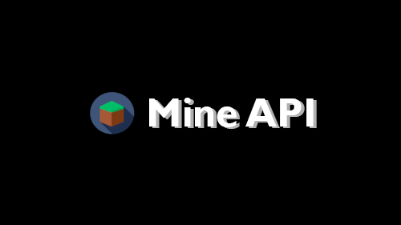

# Mine API

## Uma API REST temática de Minecraft

### :warning: _Ainda em desenvolvimento_ :warning:

<div align="center">
    
</div>

## To-Dos

---

- [x] ~~Mobs~~
- [x] ~~Encantamentos~~
- [ ] Poções

## Requisitos

---

[NodeJS](https://nodejs.org/en/) - [MongoDB](https://www.mongodb.com) - [Git](https://git-scm.com)

## Utilização

---

1. Clone o projeto com o comando `git clone https://github.com/swshadows/mine-api.git`
2. Acesse a pasta clonada e instale as dependencias com o comando `npm install`
3. Crie um banco de dados no MongoDB com o nome `mine-api`
4. Importe as coleções na pasta `db` para seu MongoDB no banco de dados `mine-api` manualmente com [MongoDB Compass](https://www.mongodb.com/try/download/compass) ou utilizando [MongoDB Tools](https://www.mongodb.com/try/download/database-tools) com os comandos:

```
mongoimport --db mine-api --collection mobs --type json --file mobs.json --jsonArray
mongoimport --db mine-api --collection enchantments --type json --file enchantments.json --jsonArray
mongoimport --db mine-api --collection potions --type json --file potions.json --jsonArray
```

5. Inicialize o servidor com o comando `npm start`
6. Acesse `http://localhost:3000` para acessar a interface

## Obrigado por testar meu projeto :smile:
